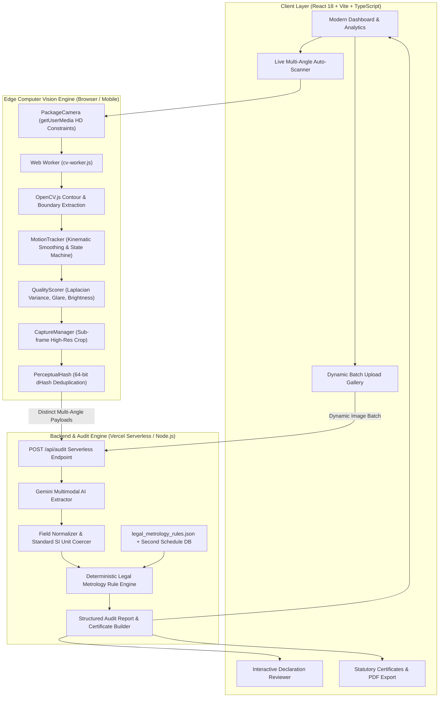

# ⚖️ METRICHECK — AI-Powered Legal Metrology Inspection & Compliance Platform

[](https://metricheck.vercel.app/)
[-10B981?style=for-the-badge&logo=vite&logoColor=white)](https://metricheck.vercel.app/)
[-3B82F6?style=for-the-badge&logo=node.js&logoColor=white)](https://metricheck.vercel.app/)
[](https://metricheck.vercel.app/)

> **SCAN. VERIFY. COMPLY.**
> Enterprise-grade Computer Vision and Multimodal AI platform designed for automated statutory compliance audits under the **Legal Metrology (Packaged Commodities) Rules, 2011** (India) and global standard weights & measures directives.

🌐 **Live Deployment**: [https://metricheck.vercel.app/](https://metricheck.vercel.app/)

---

## 📑 Table of Contents
- [Executive Overview](#-executive-overview)
- [System Architecture](#-system-architecture)
- [Core Innovation & Capabilities](#-core-innovation--capabilities)
  - [Constraint #1: Zero-Touch CV Edge Auto-Scanner](#1-zero-touch-cv-edge-auto-scanner-constraint-1)
  - [Constraint #2: Multimodal Extraction & Deterministic Rule Engine](#2-multimodal-extraction--deterministic-rule-engine-constraint-2)
- [Platform Modules & UI Tour](#-platform-modules--ui-tour)
- [Technology Stack](#-technology-stack)
- [Quick Start & Local Development](#-quick-start--local-development)
- [Automated Verification (53 Tests)](#-automated-verification-53-tests)
- [Deployment Guide (Vercel)](#-deployment-guide-vercel)
- [Statutory Rules Reference](#-statutory-rules-reference)

---

## 🌟 Executive Overview

In retail and industrial supply chains, verifying statutory declarations on packaged commodities (Manufacturer/Packer address, Net Quantity, MRP, Manufacturing Date, Country of Origin, Consumer Care details) is traditionally a slow, error-prone manual process.

**Metricheck** revolutionizes statutory compliance inspection:
1. **Edge Computer Vision Auto-Capture**: Field inspectors hold their smartphone over a package and rotate it. Metricheck's on-device computer vision engine automatically evaluates motion stability, lighting, focus, and blur to capture sharp, distinct views hands-free with zero button clicks.
2. **Multimodal AI & Deterministic Rule Verification**: High-resolution cropped package views are processed by Gemini Multimodal AI and mapped against a deterministic Legal Metrology Rule Engine to verify all 18 statutory declarations, detect illegal markings, and issue instant audit reports with exportable compliance certificates.

---

## 🏛️ System Architecture



---

## ⚡ Core Innovation & Capabilities

### 1. Zero-Touch CV Edge Auto-Scanner (Constraint #1)
- **Kinematic Motion Tracking**: Tracks package centroid and bounding box displacement across frames, maintaining a temporal state machine (`NO_OBJECT` → `MOVING` → `STABLE`).
- **Multi-Factor Quality Gate**:
  - **Sharpness Metric**: Computes Laplacian variance over the product region to reject motion blur ($> 80.0$).
  - **Adaptive Glare & Lighting Detection**: Evaluates brightness histograms and specular reflections to reject overexposed or dark environments.
  - **Framing & Aspect Ratio Guardian**: Ensures the package occupies at least 15% of the frame with aspect ratio integrity preserved across landscape, square, and portrait mobile viewports.
- **Perceptual Hash Deduplication (`dHash`)**: Generates 64-bit perceptual hashes of each captured angle. Evaluates Hamming distance ($> 12$) to guarantee only **new, distinct sides** of the package are captured.
- **Hardware Integration**: Full mobile rear-camera selection (`facingMode: environment`), camera torch toggle, haptic vibration feedback, and simulated shutter flash.

### 2. Multimodal Extraction & Deterministic Rule Engine (Constraint #2)
- **18 Statutory Declarations Extracted**:
  - Manufacturer / Packer / Importer Name & Complete Address
  - Common / Generic Commodity Name
  - Net Quantity (Value & Metric Unit)
  - Retail Sale Price (MRP, Inclusive of all taxes)
  - Month & Year of Manufacture / Packing / Import
  - Consumer Care Contact (Name, Address, Phone, Email)
  - Dimensions & Country of Origin
- **Deterministic Unit Normalization**: Converts mixed notations (e.g. `1.5 kg`, `500 gm`, `2 Litres`, `250 ml`, `10 N`) into standardized SI metric units.
- **Statutory Rules Verification**:
  - **Rule 6(1)(a)**: Presence of name and full physical address.
  - **Rule 6(1)(c)**: Mandatory SI units and prohibition of non-standard units.
  - **Rule 6(1)(e)**: Proper MRP declaration formatted as "inclusive of all taxes".
  - **Rule 6(2)**: Verification of complete multi-channel consumer care contact details.
  - **Prohibited Expressions**: Flags misleading or vague qualifiers like *"when packed"*, *"approx"*, or *"dozen"*.
  - **Second Schedule Standard Package Sizes**: Cross-references net quantity against statutory standard pack sizes for specified commodities.

---

## 🖥️ Platform Modules & UI Tour

| Module | Features & Capabilities |
| :--- | :--- |
| **📊 Executive Dashboard** | Real-time compliance health score, inspection throughput, violation breakdown charts, and recent audit logs. |
| **🔍 Live Auto-Inspection** | Dual-mode inspection interface supporting hands-free multi-angle computer vision scanning or dynamic batch photo uploads. |
| **📋 Detailed Audit Reports** | Per-check statutory pass/fail chips, rule references, extracted field inspector, and exportable official certificates. |
| **⚠️ Violations Registry** | High-severity flag tracker, non-compliant package repository, and inspector resolution workflows. |
| **📈 Analytics & Trends** | Manufacturer compliance rankings, frequent violation categories, and historical audit statistics. |
| **⚙️ Platform Settings** | Inspector role management, rule configuration, and API threshold tuning. |

---

## 🛠️ Technology Stack

- **Frontend**: React 18, Vite, TypeScript, Tailwind CSS, Lucide Icons, Framer Motion, TanStack Query, Zustand.
- **Edge Vision Pipeline**: JavaScript ES Modules, Web Workers, OpenCV.js WebAssembly, HTML5 Canvas 2D API.
- **Backend & Cloud Engine**: Node.js, Vercel Serverless Functions (`api/audit.js`), Google Gemini Multimodal AI.
- **Testing & Quality Assurance**: Native Node.js Test Runner, ES Module Test Suites.

---

## 🚀 Quick Start & Local Development

### Prerequisites
- **Node.js**: `v18.0.0` or higher
- **npm**: `v9.0.0` or higher

### 1. Clone & Install
```bash
git clone https://github.com/AllociousFranklin/Metricheck.git
cd Metricheck
npm install
```

### 2. Configure Environment Variables
Create a `.env` file in the project root:
```env
GEMINI_API_KEY=your_gemini_api_key_here
PORT=3000
```

### 3. Run Development Server
```bash
npm run dev
```
Open **`http://localhost:5173`** in your browser.

---

## 🔑 Demo Access Credentials

| Role | Email | Password | Access Scope |
| :--- | :--- | :--- | :--- |
| **Admin** | `admin@metrology.gov` | `admin123` | Full system access & compliance oversight |
| **Inspector** | `inspector@metrology.gov` | `inspect123` | Create scans, upload packages, run audits |
| **Reviewer** | `reviewer@metrology.gov` | `review123` | Review flagged non-compliances |

*(Tip: Click any credential row on the Sign-In page to auto-fill instantly!)*

---

## 🧪 Automated Verification (53 Tests)

Execute the full automated test suite covering computer vision algorithms, kinematic state machines, image normalization, and deterministic legal metrology rule checkers:

```bash
npm test
```

### Test Suite Summary:
```text
======================================================
  CONSTRAINT #1: Edge CV & Auto-Scanner (17 Tests)
======================================================
  ✓ Perceptual Hash (dHash) & Hamming Distance (5/5)
  ✓ Motion Tracker Kinematics & State Machine (6/6)
  ✓ Quality Scorer: Sharpness, Blur, Glare, Lighting (6/6)

======================================================
  CONSTRAINT #2: Legal Metrology Rule Engine (36 Tests)
======================================================
  ✓ Image Preprocessing & MIME Preparation (5/5)
  ✓ Field Normalization & Metric Unit Standardization (8/8)
  ✓ Statutory Rule Checkers: Rule 6(1)(a)-(e), Rule 6(2) (8/8)
  ✓ Non-Compliant Edge Cases & Second Schedule Pack Sizes (7/7)
  ✓ End-to-End Orchestrator & Report Generation (8/8)

======================================================
  ALL 53 TESTS COMPLETE: 53 passed, 0 failed (100% Green)
======================================================
```

---

## ☁️ Deployment Guide (Vercel)

Metricheck is production-ready for deployment on **Vercel**:

1. Fork or push this repository to GitHub.
2. Navigate to [Vercel Dashboard](https://vercel.com/new) and import the repository.
3. Add the environment variable:
   - `GEMINI_API_KEY`: Your Gemini API key.
4. Click **Deploy**.

Production URL: **[https://metricheck.vercel.app/](https://metricheck.vercel.app/)**

---

## 📜 Statutory Rules Reference

Metricheck verifies packaged commodities against standard requirements including:

- **Rule 6(1)(a)**: Name and complete address of the manufacturer, packer, or importer.
- **Rule 6(1)(b)**: Generic or common name of the commodity contained in the package.
- **Rule 6(1)(c)**: Net quantity in terms of standard unit of weight, measure, or number.
- **Rule 6(1)(d)**: Month and year in which the commodity is manufactured, packed, or imported.
- **Rule 6(1)(e)**: Maximum Retail Price (MRP) inclusive of all taxes.
- **Rule 6(2)**: Name, address, telephone number, and e-mail address of the person or office to contact in case of consumer complaints.
- **Rule 5 / Second Schedule**: Standard package quantities for specified commodities.
- **Prohibited Terminology**: Rejection of non-statutory vague qualifiers (*"when packed"*, *"approx"*).

---

## 👥 Contributors & Acknowledgements

Developed for automated Legal Metrology compliance by **Metricheck Team**.
- **Frontend & UI/UX**: [AKash-101111](https://github.com/AKash-101111)
- **Computer Vision & Legal Metrology Engine**: [AllociousFranklin](https://github.com/AllociousFranklin)

---
*Built with ❤️ for intelligent, transparent, and automated statutory compliance.*
